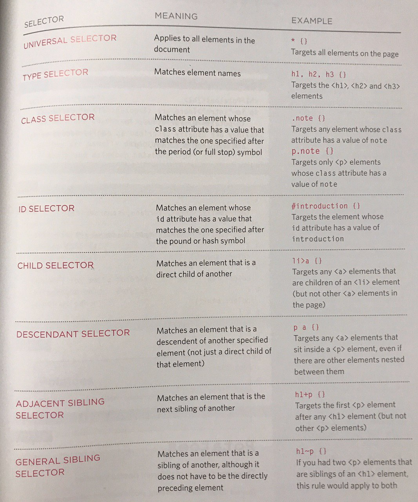

## [HTML text](#html-text), [CSS](css) Introduction, and Basic [JavaScript](javascript) Instructions

### HTML text

| Tag        | Example           | Definition  |
| ------------- |:-------------:| -----:|
| Headings      | `<h1></h1>` |  |
| Paragraphs      | `<p></p>`     |    |
| Bold | `<b></b>`      |     |
| Italic | `<i></i>`      |     |
| Superscript | `<p>This text contains <sup>superscript</sup> text.</p>`      | Superscript text appears half a character above the normal line, and is sometimes rendered in a smaller font.    |
| Subscript | `<sub></sub>`      | Subscript text appears half a character below the normal line, and is sometimes rendered in a smaller font.    |
| Line breaks | `<br/>`      |     |
| Horizontal rule | `<hr/>`      | thematic break in an HTML page, used to separate content    |
| Strong | `<strong></strong>`      | It defines important text.    |
| Emphasis | `<em></em>`      | The contents of this element in italic    |
| Blockquote | `<blockquote></blockquote>`      | Specifies a section that is quoted from another source.   |
| Q | `<q></q>`      | Defines a short quotation    |
| Abbreviations & Acronyms      | `The <abbr title="World Health Organization">WHO</abbr> was founded in 1948.`     | Defines an abbreviation or an acronym, like "HTML", "Mr.", "Dec.", "ASAP", "ATM".   |
| Citations | `<p><cite>The Scream</cite> by Edward Munch. Painted in 1893.</p>`      | defines the title of a work     |
| Definitions | `<p><dfn>HTML</dfn> is the standard markup language for creating web pages.</p>`      | Represents the defining instance of a term in HTML.  |
| Author details      | `<address></address>` | Defines the contact information for the author/owner of a document or an article. |
| Changes to content      | `<p>My favorite color is <del>blue</del> <ins>red</ins>!</p>` | Defines a text that has been inserted into a document.  |
| Changes to content      | `<p>My favorite color is <del>blue</del> <ins>red</ins>!</p>` | Defines text that has been deleted from a document.  |
| Changes to content      | `<p><s>My car is blue.</s></p>` | specifies text that is no longer correct, accurate or relevant. |


### CSS


1. External CSS
External styles are defined within the `<link>` element, inside the `<head>` section of an HTML page:

  ```
  <html>
      <head>
        <link rel="stylesheet" type="text/css" href="mystyle.css">
      </head>
      <body>

        <h1>This is a heading</h1>
        <p>This is a paragraph.</p>

      </body>
  </html>
  ```

2. Internal CSS
Internal styles are defined within the `<style>` element, inside the `<head>` section of an HTML page:

  ```
  <head>
    <style>
    body {
      background-color: linen;
    }

    h1 {
      color: maroon;
      margin-left: 40px;
    } 
    </style>
  </head>
  ```

  3. CSS selectors are patterns used to select the element(s) you want to style.
  
  
