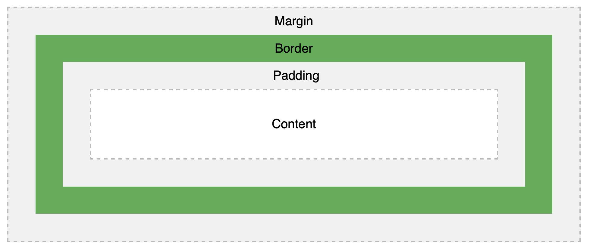
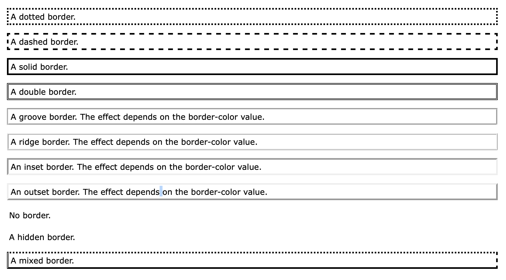

## HTML [Lists](#lists), CSS [Boxes](#boxes), JS [Control Flow](#control-flow)

### Lists

1. Ordered list 

```
<ol></ol>
```

2. Unordered list

```
<ul></ul>
```

3. Definition lists (description list, with terms and descriptions)

```
<dl>
  <dt>Coffee</dt>
  <dd>Black hot drink</dd>
  <dt>Milk</dt>
  <dd>White cold drink</dd>
</dl>
```

4. Nested lists - sublist

### Boxes

1. Width and Height properties values:
   - auto (Default value. The browser calculates the width)
   - length (Defines the width in px, cm, etc.)
   - % (Defines the width in percent of the containing block)
   - initial (Sets this property to its default value.)
   - inherit (Inherits this property from its parent element.)

2. min-height and min-width properties(defines the minimum height or width of an element) values:
   - length (Default value is 0. Defines the minimum height in px, cm, etc.)
   - % (Defines the minimum height in percent of the containing block)
   - initial
   - inherit

3. The overflow property specifies what should happen if content overflows an element's box. Values:
   - hidden (The overflow is clipped, and the rest of the content will be invisible)
   - scroll (The overflow is clipped, but a scroll-bar is added to see the rest of the content)

```
div.ex1 {
  overflow: scroll;
}
```

4. Every box has 3 availavle properties:
   - border (A border that goes around the padding and content)
   - margin (Clears an area outside the border. The margin is transparent)
   - padding (Clears an area around the content. The padding is transparent)

 

5. CSS Border Width

```
p.one {
  border-style: solid;
  border-width: 5px;
}

p.two {
  border-style: solid;
  border-width: medium;
}

p.three {
  border-style: dotted;
  border-width: 2px;
} 

p.four {
  border-style: dotted;
  border-width: thick;
}
```
6. CSS Border Style
   - dotted - Defines a dotted border
   - dashed - Defines a dashed border
   - solid - Defines a solid border
   - double - Defines a double border
   - groove - Defines a 3D grooved border. The effect depends on the border-color value
   - ridge - Defines a 3D ridged border. The effect depends on the border-color value
   - inset - Defines a 3D inset border. The effect depends on the border-color value
   - outset - Defines a 3D outset border. The effect depends on the border-color value
   - none - Defines no border
   - hidden - Defines a hidden border



7. CSS Border Color
The color can be set by:
- name - specify a color name, like "red"
- HEX - specify a HEX value, like "#ff0000"
- RGB - specify a RGB value, like "rgb(255,0,0)"
- HSL - specify a HSL value, like "hsl(0, 100%, 50%)"
- transparent

8. CSS Border - Shorthand Property

```
p {
  border: 5px solid red;
}
```

9. CSS Padding (used to generate space around an element's content, inside of any defined borders)

```
div {
  padding-top: 50px;
  padding-right: 30px;
  padding-bottom: 50px;
  padding-left: 80px;
}
```

10. CSS Margins (used to create space around elements, outside of any defined borders)

```
p {
  margin-top: 100px;
  margin-bottom: 100px;
  margin-right: 150px;
  margin-left: 80px;
}
```

11. CSS display Property (specifies the display behavior (the type of rendering box) of an element.)

```
p.ex1 {display: none;}
p.ex2 {display: inline;}
p.ex3 {display: block;}
p.ex4 {display: inline-block;}
```

12. CSS visibility Property (specifies whether or not an element is visible.)

```
h2.a {
  visibility: visible;
}

h2.b {
  visibility: hidden;
}
```

13. CSS border-image Property (allows you to specify an image to be used as the border around an element.)

```
#borderimg { 
  border-image: url(border.png) 30 round;
}
```

- border-image-source
- border-image-slice
- border-image-width
- border-image-outset
- border-image-repeat

14. CSS box-shadow Property (attaches one or more shadows to an element.)

```
#example1 {
  box-shadow: 5px 10px;
}

#example2 {
  box-shadow: 5px 10px #888888;
}
```

15. CSS border-radius Property (defines the radius of the element's corners.)

```
#example1 {
  border: 2px solid red;
  border-radius: 25px;
}

#example2 {
  border: 2px solid red;
  border-radius: 50px 20px;
}
```

### Control Flow

1. `switch` statement to select one of many code blocks to be executed.

```
switch(expression) {
  case x:
    // code block
    break;
  case y:
    // code block
    break;
  default:
    // code block
}
```

2. Type coercion is the process of converting value from one type to another (such as string to number, object to boolean, and so on). 

3. Truthy and Falsy
The following values are always falsy:
- false
- 0 (zero)
- '' or "" (empty string)
- null
- undefined
- NaN

Everything else is truthy. That includes:
- '0' (a string containing a single zero)
- 'false' (a string containing the text “false”)
- [] (an empty array)
- {} (an empty object)
- function(){} (an “empty” function)

4. Loops
- for - loops through a block of code a number of times
- for/in - loops through the properties of an object
- for/of - loops through the values of an iterable object
- while - loops through a block of code while a specified condition is true
- do/while - also loops through a block of code while a specified condition is true

```
for (statement 1; statement 2; statement 3) {
  // code block to be executed
}
```

```
for (i = 0; i < 5; i++) {
  text += "The number is " + i + "<br>";
}
```

```
while (condition) {
  // code block to be executed
}
```

```
while (i < 10) {
  text += "The number is " + i;
  i++;
}
```
